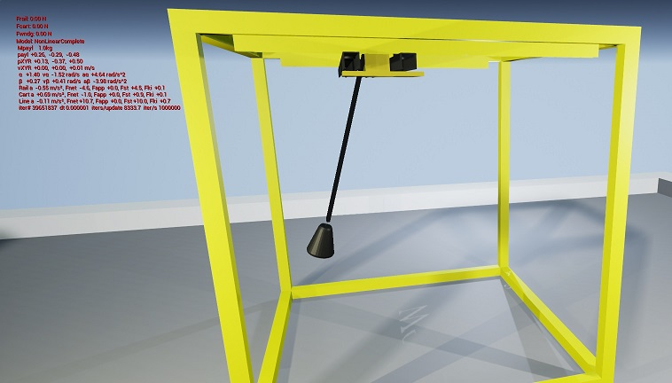
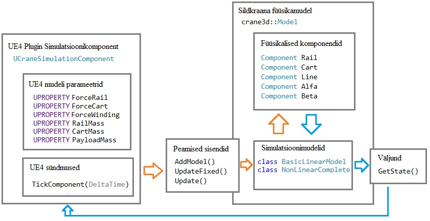
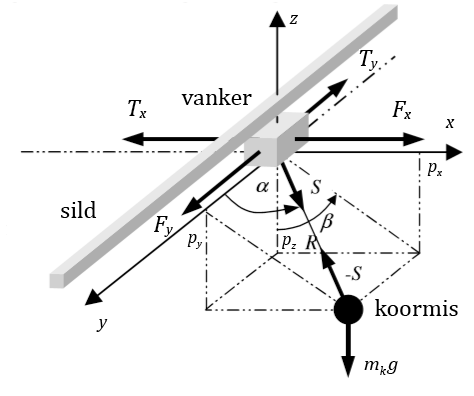

# 3D Crane physics model plugin for Unreal Engine 4

This repository contains a portable C++17 library for simulation INTECO 3DCrane and necessary Unreal Engine 4 bindings for visualization. For detailed description of this library, you can read the Diploma Thesis in Estonian [Jorma_Rebane_Diplomitoo.pdf](Jorma_Rebane_Diplomitoo.pdf)

You should also take a look at a simple project which uses this plugin: [CraneVR](https://github.com/RedFox20/CraneVR)



## Setting up a basic build environment
The original version is built and tested with **Visual Studio 2017**, using C++17. For testing the plugin in a standalone console application, you can open Tests/Crane3dPluginTests.sln

## How to add this to my project?
Simply add this plugin into **YourProject/Plugins/Crane3dPlugin** and compile your UE4 C++ project. The plugin and all its components are then accessible in the UE4 Editor after relaunching.

Alternatively after adding the plugin you can right click on YourProject.uproject and select "Generate Visual Studio project files" and then build everything through YourProject.sln.


## How does this plugin work?
The simplistic overview of this simulation model is displayed in the following image. USimulationComponent sends appropriate inputs from UE4 and configures any parameters during runtime. During TickComponent, we call Model::UpdateFixed which will advance the simulation and returns the new observable state of the crane.




## How do I add new simulation implementations?
First you need to create a new class and inherit from crane3d::IModelImplementation. And of course implement the behaviour of Update and GetState(). You can see existing implementations in [ModelImplementation.cpp](Source/CraneModel/Private/ModelImplementation.cpp)
```cpp
    class MyCustomLinearModel : public crane3d::IModelImplementation
    {
    public:
        using IModelImplementation::IModelImplementation;
        string Name() const override { return "MyLinearModel"; }
        void Update(double dt, Force Frail, Force Fcart, Force Fwind) override;
        CraneState GetState() const override;
    };
```
Then you can add your implementation to the crane model:
```cpp
crane3d::Model model;
model.AddModel(std::make_shared<MyCustomLinearModel>(model));
```

In order to understand the existing physics components Rail(X), Cart(Y), Line(R), Alfa, Beta, then more in-depth analysis of the 3DCrane mathematical model is required. The following illustration from the diploma thesis describes the relations between the components. It must be mentioned that Alfa is part of the spherical coordinate system, so the angle is between Y axis and the cable itself.




## How do I control the crane so it will follow a pattern?
For this purpose, you must include [CraneController.h](Source/CraneModel/Public/CraneController.h) and use it to drive the simulation:
```cpp
    crane3d::CraneController controller {&model};
    controller.SetDrivingForces(34_N, 30_N, 34_N);
    controller.SetWayPoints({
        {-0.3,  0.0,  0.5, 0, 1},
        {+0.3,  0.0,  0.5, 0, 1},
        { 0.0,  0.0,  0.5, 0, 1},

        { 0.0, -0.35, 0.5, 0, 1},
        { 0.0, +0.35, 0.5, 0, 1},
        { 0.0,  0.0,  0.5, 0, 1},
    });
    controller.Run(0.001, 12.0); // run for 12 seconds with a 0.001 timestep
```
This is a very basic waypoint-following controller that could need a lot of improvement.

## How do I test without Unreal Engine 4?
The testing console application is created to allow quick iteration and debugging. The next step after debugging is recording your simulation to a CSV file, so you can generate a nice graph in Excel. Unfortunately there are no unit tests for this project.
```cpp
    crane3d::Model model { "NonLinearComplete" };
    model.SetOutputCsv("NonLinear_Cross_12s_34N.csv");
    
    using namespace crane3d::literals;
    model.UpdateFixed(0.001, 3.0, 34_N, 0_N, 0_N);
```

## Is this everything that is needed?
Not quite. This is a minimal implementation with many useful utilities, but there are many things that can be improved upon:
* Keeping state inside the models to allow different physics component systems
* Resetting each model separately to their default configuration and initializing them on the fly
* Implementing a 3D vector based model
* Expanding the CraneController to make stabilizing control algorithm development convenient

All in all there is a lot to improve!
